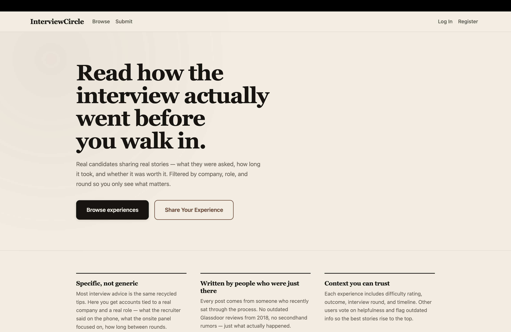
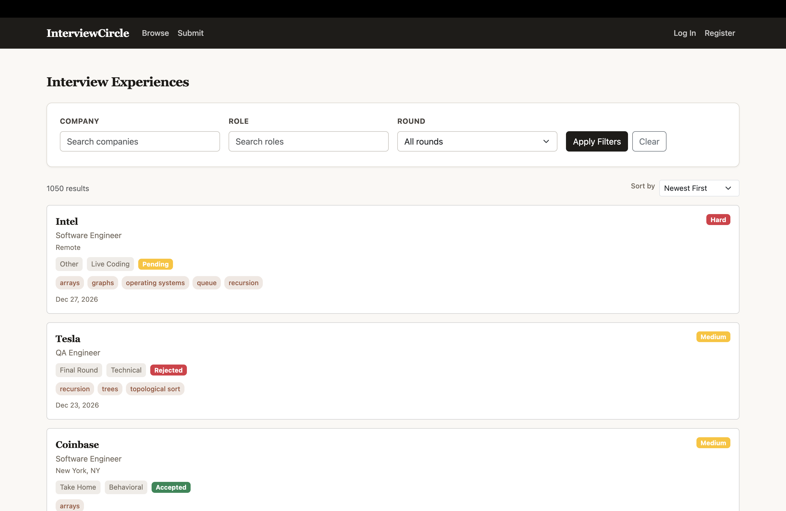
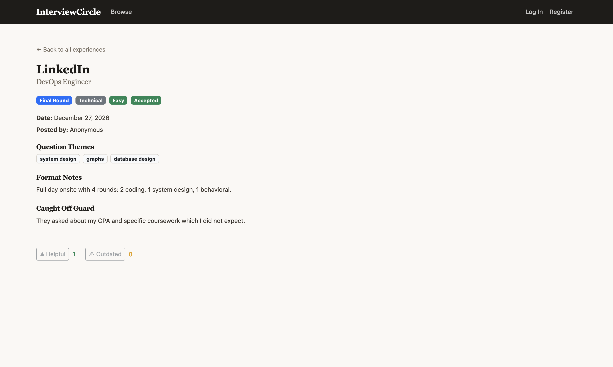
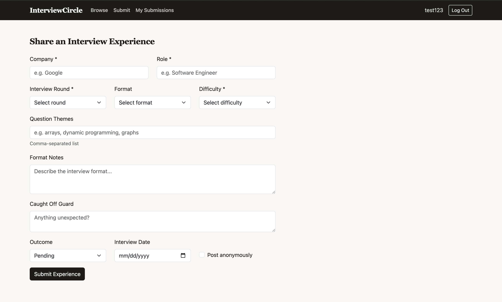
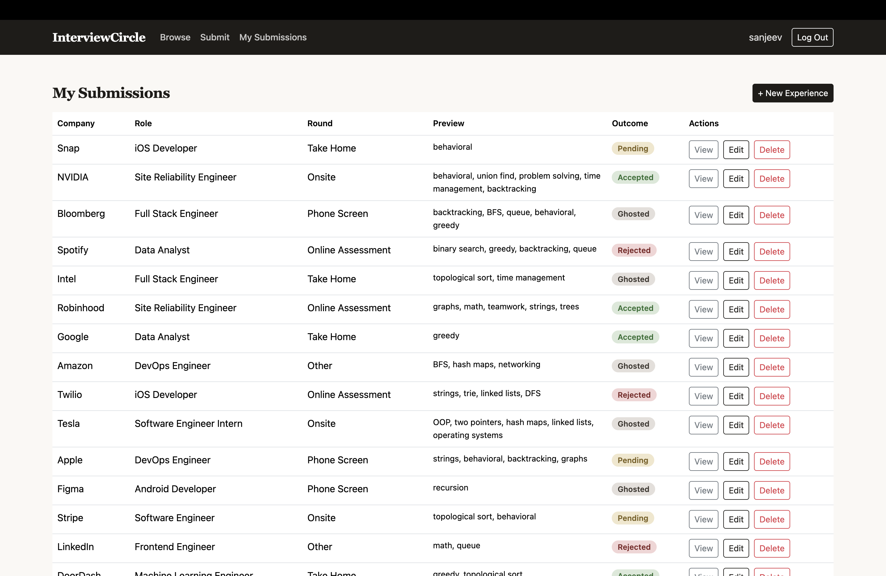

# InterviewCircle

A student-focused platform for sharing structured interview experiences — filtered by company, role, and round so you can prepare with real, recent accounts instead of generic advice.

## Authors

- **Sanjeev Kushal Pendekanti** — Interview Experience Submissions
- **Harsh Raj** — Accuracy and Relevance Signals

## Course Details

**Course:** [CS 5610 — Web Development](https://johnguerra.co/classes/webDevelopment_online_spring_2026/)

**Professor:** [John Alexis Guerra Gomez](https://johnguerra.co/)

**Semester:** Spring 2026

## Links

[View Deployed App](https://interview-circle.onrender.com)

[View Demo Video](https://youtu.be/gV_Mh06K-2s)

[View Design Document](https://drive.google.com/file/d/1AevZGUlXZkUT2PzhNpeC4g2NXxyohoiA/view?usp=sharing)

## Project Objective

Interview preparation resources are often too generic, while the most useful details — round format, question themes, difficulty level, and what caught candidates off guard — are usually only known by students who recently went through the process. That information often disappears quickly in private chats, Discord messages, or scattered notes.

InterviewCircle solves this by allowing students to submit interview experiences in a structured way and browse previous experiences by company, role, round, and recency. It also adds community signals like helpfulness ratings and outdated flags so users can better judge what to trust.

## Screenshots

**Landing Page**



**Browse Experiences**



**Experience Detail**



**Submit Experience**



**My Submissions**



## Design

### Color Palette

| Color      | Hex       | Usage                                 |
| ---------- | --------- | ------------------------------------- |
| Ink        | `#1e1c19` | Primary text, headings, buttons       |
| Paper      | `#faf8f4` | Page background                       |
| Warm Paper | `#f3ede2` | Landing page background               |
| Muted      | `#756b60` | Secondary text, labels, captions      |
| Accent     | `#9b5740` | Links, hover states, theme tags       |
| Border     | `#ddd8d0` | Card borders, dividers, input borders |

The palette is intentionally warm and muted, drawing from paper and ink tones to create a calm, editorial feel that keeps the focus on content rather than chrome.

### Font Pairing

| Font                                                                 | Type       | Usage                                     |
| -------------------------------------------------------------------- | ---------- | ----------------------------------------- |
| [Newsreader](https://fonts.google.com/specimen/Newsreader)           | Serif      | Headings, company names, section titles   |
| [Instrument Sans](https://fonts.google.com/specimen/Instrument+Sans) | Sans-serif | Body text, labels, buttons, form controls |

**Why these fonts:** Newsreader is an editorial serif that gives headings a professional, trustworthy feel appropriate for interview content. Instrument Sans is a clean geometric sans-serif that pairs well for UI text — it's highly readable at small sizes and keeps the interface feeling modern without competing with the headings.

### Design Principles

- **Contrast:** Dark ink text on warm white backgrounds creates strong readability. Colored badges (green for Accepted, red for Hard/Rejected, yellow for Medium/Pending) draw attention to key metadata. The accent color is reserved for interactive elements like links and theme tags.
- **Repetition:** Every experience card uses the same layout — company name, role, badges, themes, and footer. The same badge styles, button variants, and section heading patterns repeat across the browse page, detail page, and submission form. Filter controls and action buttons use consistent sizing and weight.
- **Alignment:** The Bootstrap grid system provides consistent column alignment across all pages. Form fields align in rows, card content is left-aligned, and the detail page follows a clear top-to-bottom reading flow with left-aligned sections.
- **Proximity:** Related information is grouped together — badges for round, format, difficulty, and outcome sit in a single row. Question themes cluster as tags. Filter inputs are grouped in one horizontal bar. Action buttons (Edit, Delete, View) are placed together in the same table cell.

## Usability Study

We conducted a usability study with 5 participants. The study identified 8 prioritized issues, all of which have been addressed in the final project.

Full study report: [Usability Study Report - Interview Circle.pdf](https://drive.google.com/file/d/1UjISxZBPAnttNz_7z0xxEQWrupt2EceK/view?usp=sharing)

## Accessibility (WCAG 2.0)

The application follows WCAG 2.0 guidelines to ensure it is usable by all users, including those who rely on keyboards and assistive technology.

**Keyboard navigation:** The entire application is navigable by keyboard. All interactive elements (links, buttons, form controls, dropdowns) are reachable via Tab and operable with Enter/Space. The custom autocomplete filter supports ArrowUp/Down to navigate suggestions, Enter to select, and Escape to close.

**Skip navigation:** A "Skip to main content" link is the first focusable element on every page. It is visually hidden until focused, allowing keyboard users to bypass the navigation bar.

**Landmarks and structure:** Every page is wrapped in a `<main>` landmark. Headings follow a logical hierarchy (h1 for page titles, h2 for sections, h3 for subsections). The `<html>` element includes `lang="en"`.

**Focus management:** Focus-visible outlines are present on all interactive elements including landing page CTAs, form inputs, and buttons. The delete confirmation uses a Bootstrap Modal with focus trapping and Escape-to-close. No `outline: none` is used anywhere in the CSS.

**Color contrast:** All text meets WCAG AA contrast requirements (minimum 4.5:1 ratio for normal text). Muted text colors were tested and adjusted to meet this threshold against their backgrounds.

**ARIA and semantics:** The autocomplete filter uses the ARIA combobox pattern (`role="combobox"`, `aria-expanded`, `aria-controls`, `aria-activedescendant`, `role="listbox"`, `role="option"`). Form validation errors use `role="alert"` for screen reader announcements. Form labels are associated with controls via `controlId`.

**Signals for logged-out users:** Helpful and Outdated controls display clear inline text ("Log in to vote" / "Log in to flag") as clickable links rather than disabled buttons with hover-only tooltips, ensuring the guidance is visible without mouse interaction.

## Tech Stack

- **Backend:** Node.js, Express 5
- **Database:** MongoDB (native driver, no Mongoose)
- **Frontend:** React 19 with Hooks, React Router, React Bootstrap
- **Authentication:** Passport.js (local strategy) with express-session
- **Tooling:** Vite, ESLint, Prettier, Nodemon

## Test Accounts

All seeded accounts use the password `password123`:

| Username    | Password      |
| ----------- | ------------- |
| `sanjeev`   | `password123` |
| `harsh`     | `password123` |
| `alex_chen` | `password123` |

## Getting Started

### Prerequisites

- Node.js (v18+)
- MongoDB running locally or a MongoDB Atlas connection string

### Installation

1. Clone the repo:

   ```bash
   git clone https://github.com/Kushal187/interview-circle.git
   cd interview-circle
   ```

2. Install backend dependencies:

   ```bash
   npm install
   ```

3. Install frontend dependencies:

   ```bash
   cd frontend
   npm install
   cd ..
   ```

4. Create a `.env` file in the root (see `.env.example`):

   ```
   MONGODB_URI=mongodb+srv://<user>:<password>@cluster.mongodb.net/
   PORT=3000
   SESSION_SECRET=your-random-secret-string
   ```

5. Seed the database with sample data (1000+ records):

   ```bash
   npm run seed
   ```

6. Start the backend server:

   ```bash
   npm run dev
   ```

7. In a separate terminal, start the frontend dev server:

   ```bash
   cd frontend
   npm run dev
   ```

8. Open [http://localhost:5174](http://localhost:5174) in your browser.

### Production Build

To serve the frontend from Express directly:

```bash
cd frontend
npm run build
cd ..
npm start
```

Then open [http://localhost:3000](http://localhost:3000).

### Available Scripts

| Command          | Description                           |
| ---------------- | ------------------------------------- |
| `npm start`      | Start the Express server              |
| `npm run dev`    | Start with nodemon (auto-restart)     |
| `npm run seed`   | Seed all collections with sample data |
| `npm run lint`   | Run ESLint                            |
| `npm run format` | Format code with Prettier             |

Frontend (run from `frontend/`):

| Command           | Description              |
| ----------------- | ------------------------ |
| `npm run dev`     | Start Vite dev server    |
| `npm run build`   | Build for production     |
| `npm run preview` | Preview production build |

## Project Structure

```
interview-circle/
├── index.js                 # Express server entry point
├── config/
│   └── passport.js          # Passport.js local strategy config
├── db/
│   └── connectDB.js         # MongoDB connection (singleton)
├── middleware/
│   └── auth.js              # Authentication middleware
├── controllers/
│   ├── authController.js    # Register, login, logout, session
│   ├── userController.js    # Current user endpoint
│   ├── experienceController.js  # CRUD for interview experiences
│   └── signalController.js  # CRUD for helpfulness/outdated signals
├── routes/
│   ├── auth.js              # /api/auth endpoints
│   ├── users.js             # /api/users endpoints
│   ├── experiences.js       # /api/experiences endpoints
│   └── signals.js           # /api/signals endpoints
├── seed/
│   └── seed.js              # Database seed script (1050+ records)
└── frontend/
    ├── index.html
    ├── vite.config.js
    └── src/
        ├── main.jsx         # React entry point
        ├── App.jsx          # Routes and layout
        ├── context/         # UserContext (auth state)
        ├── services/        # API service layer (fetch calls)
        ├── components/      # Reusable UI components
        │   ├── Navbar.jsx
        │   ├── ProtectedRoute.jsx
        │   ├── ExperienceCard.jsx
        │   ├── ExperienceForm.jsx
        │   ├── ExperienceFilters.jsx
        │   ├── SortControls.jsx
        │   ├── HelpfulVote.jsx
        │   └── OutdatedFlag.jsx
        └── pages/           # Page-level components
            ├── LandingPage.jsx
            ├── LoginPage.jsx
            ├── RegisterPage.jsx
            ├── ExperienceListPage.jsx
            ├── ExperienceDetailPage.jsx
            ├── CreateExperiencePage.jsx
            ├── EditExperiencePage.jsx
            └── MySubmissionsPage.jsx
```

## AI Disclosure

We used Claude (Anthropic) in a limited capacity during development:

- **Seed data generation** — helped write the seed script that produces 1000+ sample records for experiences and signals.
- **CSS layout debugging** — used it to troubleshoot styling issues with Bootstrap overrides and component layouts.
- **Authentication** — helped troubleshoot parts of the Passport.js setup and session configuration.
- **Code review** — used it to identify lint errors, missing PropTypes, and potential issues across the codebase.
- **README** — used it to help draft and structure this README.

All application logic, database queries, React components, authentication flow, and project architecture were written by us. We referenced the MongoDB Node.js driver docs, Express 5 docs, React docs, and Passport.js docs.

## License

[MIT](/LICENSE)
